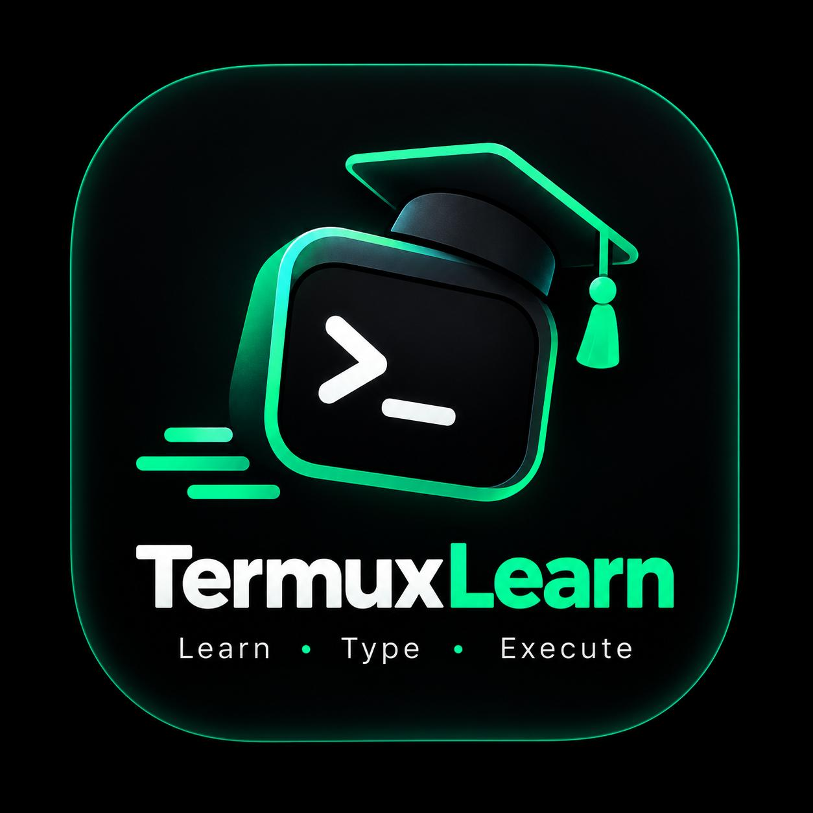

# 🐉 Termux Coding Learn

> **Learn Termux commands & coding skills through interactive typing practice**
> 
> Built by **Iminthisera Team** | Offline-first | 400+ Lessons | Windows + Android



## ✨ Features

| Feature | Description |
|---------|-------------|
| 🎯 **Shadow Text Typing** | See what to type, type it accurately, press ENTER to execute |
| 📚 **400+ Lessons** | 40 JSON lesson files, 10 exercises each |
| 🎮 **Level Progression** | Unlock levels by achieving 70%+ accuracy |
| 🏆 **XP & Achievements** | Earn points, track streaks, unlock badges |
| 🌐 **Bilingual** | English + Indonesian (Bahasa Indonesia) |
| 🔌 **Offline First** | Works without internet after first load |
| 💻 **Windows EXE** | Native desktop app via Electron |
| 📱 **Android APK** | Native mobile app via Capacitor |
| 🖥️ **Terminal Simulator** | Practice commands in a safe environment |
| 📝 **Code Playground** | Run Python, JavaScript, Bash snippets |

## 🚀 Quick Start

### Prerequisites
- Node.js 20+
- Java 17 (for Android build)
- Android SDK (for Android build)

### Install
```bash
npm install
```

### Development
```bash
npm run dev          # Start dev server
npm run electron:dev # Run Electron dev mode
```

### Build Windows EXE
```bash
npm run electron:build
# Output: dist-electron/Termux Coding Learn Setup.exe
```

### Build Android APK
```bash
npm run android:sync   # Sync Capacitor
npm run android:build  # Build APK
# Output: capacitor/android/app/build/outputs/apk/
```

## 📁 Lesson File Structure

Add new lessons by creating JSON files in `src/data/lessons/`:

```
src/data/lessons/
├── lesson-01.json   # Level 1: Navigation Basics
├── lesson-02.json   # Level 2: Directory Operations
├── lesson-03.json   # Level 3: File Operations
├── ...
├── lesson-40.json   # Level 40: Mobile Dev
```

### Lesson File Format
```json
{
  "level": 1,
  "level_name": "Navigation Basics",
  "difficulty": "beginner",
  "required_score": 70,
  "total_exercises": 10,
  "exercises": [
    {
      "id": "L1-E1",
      "type": "command",
      "category": "navigation",
      "instruction": "Type the command to update package lists",
      "instruction_id": "Ketik perintah untuk memperbarui daftar paket",
      "shadow_text": "pkg update",
      "expected_output": ["Hit:1 https://packages.termux.dev/..."],
      "hint": "Use 'pkg' wrapper to update repositories",
      "hint_id": "Gunakan wrapper 'pkg' untuk update repositori",
      "time_limit": 15,
      "xp": 10,
      "penalty_per_error": 2
    }
  ]
}
```

## 🏗️ Architecture

```
termux-coding-learn/
├── src/
│   ├── components/
│   │   ├── Layout.jsx         # App shell with nav
│   │   └── TypingEngine.jsx   # Core typing engine
│   ├── screens/
│   │   ├── HomeScreen.jsx     # Dashboard & level grid
│   │   ├── LessonScreen.jsx   # Typing practice
│   │   ├── TerminalScreen.jsx # Terminal simulator
│   │   ├── CodingScreen.jsx   # Code playground
│   │   ├── ProfileScreen.jsx  # Stats & achievements
│   │   └── SettingsScreen.jsx # App settings
│   ├── utils/
│   │   ├── storage.js         # Offline storage (localforage)
│   │   ├── ProgressContext.jsx # Progress state management
│   │   └── OfflineContext.jsx  # Online/offline detection
│   └── data/lessons/
│       ├── lesson-01.json     # Auto-loaded lesson files
│       └── lesson-40.json
├── electron/                   # Windows EXE build
├── capacitor/                  # Android APK build
├── .github/workflows/
│   └── main.yml               # CI/CD: builds EXE + APK
└── package.json
```

## 🔄 CI/CD (GitHub Actions)

The `main.yml` workflow automatically builds both platforms:

| Trigger | Windows EXE | Android APK |
|---------|-------------|-------------|
| Push to `main` | ✅ | ✅ |
| Pull Request | ✅ | ✅ |
| Manual dispatch | ✅ | ✅ |

Artifacts are uploaded and auto-released on pushes to `main`.

## 📝 Adding New Lessons

1. Create `src/data/lessons/lesson-XX.json`
2. Follow the format above
3. The app auto-discovers new lesson files on startup
4. No code changes needed!

## 🐛 Tech Stack

- **Frontend**: React 18 + Vite + Tailwind CSS + Framer Motion
- **Desktop**: Electron 28
- **Mobile**: Capacitor 5 + Android SDK
- **Storage**: localForage (IndexedDB wrapper)
- **Icons**: Lucide React
- **CI/CD**: GitHub Actions

## 📜 License

MIT License - Iminthisera Team

---

<p align="center">
  
  <br/>
  <b>Learn. Type. Code. Master Termux.</b>
</p>
